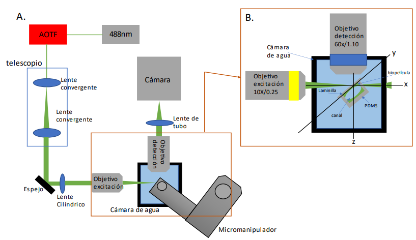
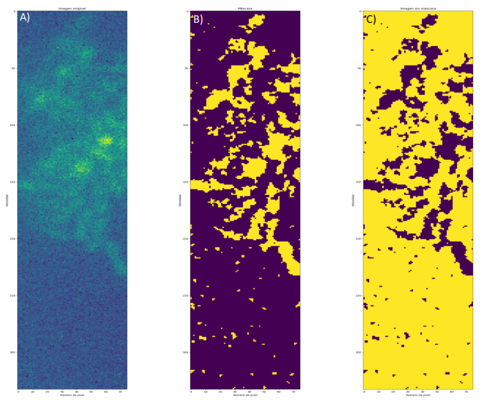

# E. coli Biofilm Stress Analysis via Light-sheet Microscopy

Quantitative image analysis pipeline for tracking gene expression dynamics in E. coli biofilms under metabolic stress, from Light Sheet Fluorescence Microscopy (LSFM) time-lapse data. Processes GFP fluorescence intensity (pRpoH heat-stress reporter) across microfluidic chip experiments, reconstructing community-level expression curves over time.



Figure 1. System setup. In A, we can see an image of the general LSFM-SPIM setup, starting with a 488nm laser passing through an AOTF for modulation. The chip is placed inside a water-filled chamber for sample acquisition through the coverslip. B shows a close-up highlighting the specific sample identification using a dedicated detection objective.

## Background

Biofilms are closely linked to bacterial virulence and antibiotic resistance strategies. Understanding how stress-response genes drive biofilm formation is key to tackling these mechanisms. This project uses Light Sheet Fluorescence Microscopy (LSFM) to capture the real-time dynamics of biofilm formation in Escherichia coli K12 under ethanol-induced metabolic stress (90% EtOH), tracking expression of the heat-stress reporter pRpoH via GFP fluorescence in a custom PDMS microfluidic chip.

This repository contains the image processing and data reconstruction pipeline built to extract quantitative insights from those experiments.

## Pipeline overview

```text
       Raw LSFM time-lapse images
                   │
                   ▼
         Fiji / ImageJ (Pre-processing)
   ┌────────────────────────────────────────┐
   │ · Optical blur & angle correction      │
   │ · Geometric reordering (D = 2*cos(α))  │
   └────────────────────────────────────────┘
                   │
                   ▼
         Corrected .tif Stacks
                   │
                   ▼
         image_processing.py
   ┌────────────────────────────────────────┐
   │ · Top-Hat morphological filter         │
   │ · Thresholding & Segmentation (Otsu)   │
   │ · Mean GFP intensity extraction        │
   └────────────────────────────────────────┘
                   │
                   ▼
         main.py (Batch execution)
                   │
                   ▼
         Per-frame .txt intensity data
                   │
                   ▼
         reconstruct_intensity.py
   ┌────────────────────────────────────────┐
   │ · Read & normalize intensity data      │
   │ · Plot community gene expression curve │
   └────────────────────────────────────────┘
                   │
                   ▼
      Gene expression dynamics plot
```

### 🔬 Fiji Pre-processing Step
Before running the Python pipeline, raw LSFM images must be pre-processed in **Fiji (ImageJ)**. This corrects optical distortions, defocusing, and the deskew angle caused by the physical microfluidic chip mounting using the trigonometric relationship $D_{\mu m} = 2 \cdot \cos(\alpha)$.

## Repository structure

| File | Description |
| :--- | :--- |
| **image_processing.py** | Core image processing library. Applies morphological filtering (Top-Hat) and extracts mean GFP fluorescence intensity frame by frame. |
| **main.py** | Main execution script. Sets analysis parameters and runs the batch processing pipeline over the full image set. |
| **reconstruct_intensity.py** | Post-processing module. Reads per-image intensity outputs and reconstructs the community-level gene expression curve across time. |



Figure 2: Image reconstruction workflow. This workflow tracks intensity values for microorganisms and their communities over time. The pipeline generates two processed images from the original frame: A) Original image captured by the microscope, showing the organisms at a specific time point. B) Intensity-based segmentation, where numerical values are extracted for organisms of this size, highlighted in yellow. C) Contrast/Background mask, where everything not identified as an "organism" is isolated as background, acting as the exact inverse of image B.

## Experimental context

| Parameter | Details |
| :--- | :--- |
| **Organism** | Escherichia coli K12 |
| **Reporter** | GFP (pRpoH — heat-stress promoter) |
| **Stress condition** | Ethanol 90% (metabolic stress) |
| **Imaging technique** | Light Sheet Fluorescence Microscopy (LSFM) |
| **Device** | PDMS microfluidic chip + coverslip |
| **Readout** | Mean GFP fluorescence intensity over time |

## Author

**Juan Sebastian Zapata Acosta**
* Microbiologist — MSc Candidate in Computational Biology · Universidad de los Andes
* [GitHub]((https://github.com/Juansebastianzapataacostaa)) · [LinkedIn](https://www.linkedin.com/in/juan-sebastian-zapata-acosta-789bb6224) · 10.sebsatian.zapa@gmail.com

## Citation

If you use this pipeline, code, or experimental context in your research, please cite the official thesis published in the Universidad de los Andes repository:

> Zapata Acosta, J. S. (2024). *Evaluación de expresión génica de biopelículas en comunidades de E. Coli por estrés, a partir de microscopía de hoja de luz* (Master's thesis, Universidad de los Andes). Retrieved from [Séneca - Repositorio Institucional Uniandes](https://repositorio.uniandes.edu.co/entities/publication/023896e3-58bd-46ab-b7ad-8b47eedfe04a).

## License

MIT License — free to use with attribution.
